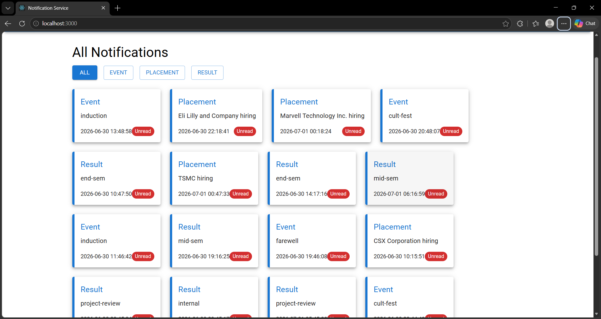
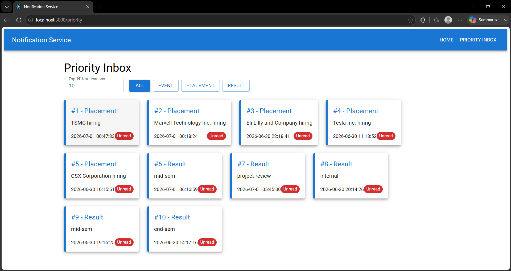

# Campus Evaluation Notification System

This project implements a robust notification system with a priority-based inbox. It is divided into a frontend (`notification-app-fe`) and a backend (`notification-app-be`).

## Features

- **All Notifications:** View all incoming notifications categorised by Event, Placement, and Result.
- **Priority Inbox:** A specialized inbox that dynamically tracks and displays the top 'N' (e.g., top 10) most important unread notifications.
- **Priority Logic:** Priorities are calculated based on a combination of weights (`Placement = 3`, `Result = 2`, `Event = 1`) and recency.
- **Efficient Data Structure:** Utilizes a Min-Heap (Priority Queue) to maintain the top 'N' notifications optimally (`O(log n)` insertion time).

## Screenshots

### All Notifications


### Priority Inbox


## Architecture

The logic to find and maintain the top notifications efficiently is implemented using a Min-Heap data structure in `notification-app-fe/src/utils/PriorityQueue.js`.

## Getting Started

### Prerequisites
- Node.js and npm installed

### Frontend Setup
```bash
cd notification-app-fe
npm install
npm run dev
```

### Backend Setup
```bash
cd notification-app-be
npm install
npm start
```
